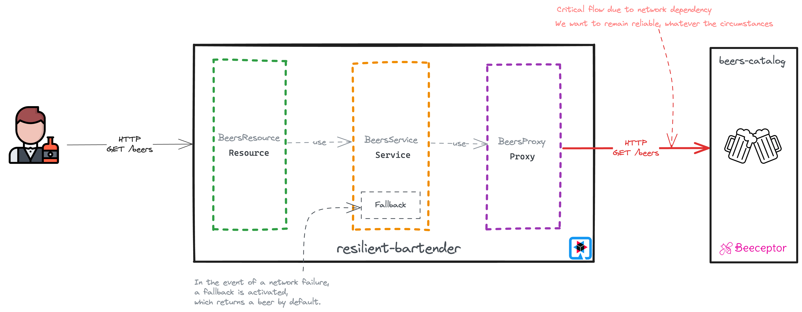
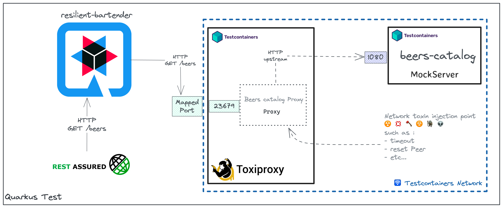

# What ? 🤷🏽‍♂️
Distributed computing is subject to a number of important [considerations][fallacies-of-distributed-computing]. Many of these considerations relate to network aspects:
- _The network is reliable_
- _Latency is zero_
- _Bandwidth is infinite_

In relation to these considerations and constraints, software architects define certain software features, such as :
- Performance
- Reliability
- etc...

To implement or set up these features, software developers or engineers use tools or specifications such as :
- Microprofile Fault Tolerance
- Istio Traffric Management
- Reslilience4j
- etc.

To validate these implementations, we need to write resilience tests on well-identified scenarios (this is also chaos engineering). In architectural terms, this is known as the fitness function.

Resilience testing generally consists of injecting network failures, in order to observe the behavior of our system.
> ℹ️ For those using the Istio Mesh Service, there's Istio Fault Injection

In this project, I propose to set up these resilience tests, using tools such as [Toxiproxy][toxi-proxy] and [Testcontainers][test-containers].

# Illustration 🎨
## Base layer architecture


## Configuring and implementing resilience tests with Toxiproxy


# Run tests on local 🧪
## Prerequisites
- Must have Java 21 + (You can install it via [SDKMan][sdkman])
```bash
# List the different distributions of Java 21
sdk list java | grep 21

# install java 21
sdk install java 21-open
```
- Must have Docker
## Command 🕹️
```bash
mvn test
```
> To confirm the **_Retry_**, look at the logs :
> 
> 2023-09-26 07:41:07,039 INFO  [me.nzu.res.bar.BeersService] (quarkus-virtual-thread-2) Attempt - 1 </br>
> 2023-09-26 07:41:07,039 INFO  [me.nzu.res.bar.BeersService] (quarkus-virtual-thread-2) Attempt - 2 </br>
> 2023-09-26 07:41:07,039 INFO  [me.nzu.res.bar.BeersService] (quarkus-virtual-thread-2) Attempt - 3
# Run tests on CI/CD
Refer to [Testcontainers on Gitlab CI][test-containers-on-gitlab-ci]

# Warning ⚠️
These are relatively costly tests, in terms of execution time (so the feedback loop can be slowed down).

But don't forget the most important principle of software testing:
> Early Testing Saves Time And Money

# Useful links 🔗
- [Quarkus][quarkus]
- [Testcontainers Java][test-containers-java]
- [Toxiproxy][toxi-proxy]
- [Mock Server][mock-server]
- [Toxiproxy Spring Boot Example][toxi-proxy-spring-boot-example]

<!-- links -->
[quarkus]: https://quarkus.io/
[test-containers-java]: https://java.testcontainers.org/
[mock-server]: https://www.mock-server.com/
[toxi-proxy-spring-boot-example]: https://www.atomicjar.com/2023/03/developing-resilient-applications-with-toxiproxy-and-testcontainers/
[fallacies-of-distributed-computing]: https://en.wikipedia.org/wiki/Fallacies_of_distributed_computing
[toxi-proxy]: https://github.com/Shopify/toxiproxy
[test-containers]: https://testcontainers.com/
[sdkman-doc]: https://sdkman.io/
[test-containers-on-gitlab-ci]: https://www.atomicjar.com/2023/01/running-testcontainers-tests-on-gitlab-ci/